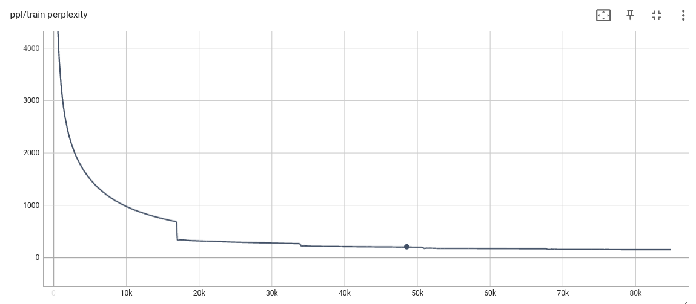
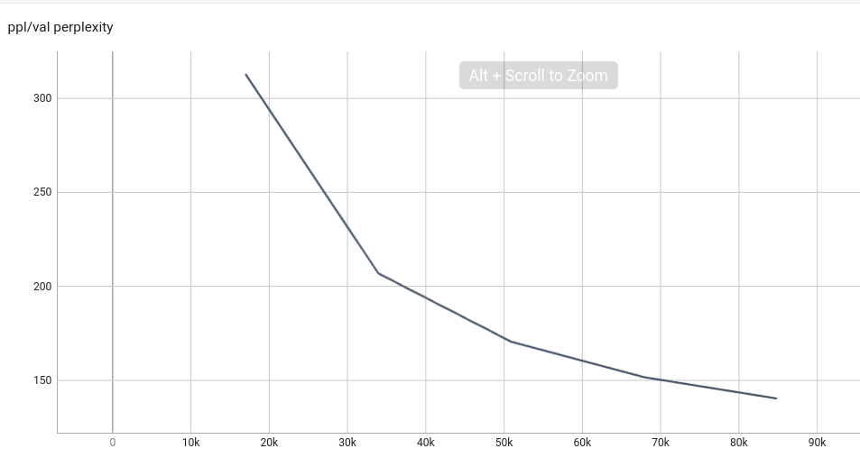

# Transformer based Nepali Language Generation Model

## Problem Specification
- Since, Nepali language is rich in vocabulary, it is confusion for many people to choose the right vocab. The language model can help you choose the vocab you need.
- Confusion in ह्रस्व दीर्घ and other grammatical rules in Nepali language can cause lots of spelling mistake. But through this language model, the spelling correction system can be developed which can understand the context of the text and correct them. 
- Lack of reliable language model for low resource language like Nepali, it is very difficult to perform various downstream tasks like text classification, question answering, summarization, etc.

## Objectives
Nepali language generation model was trained and developed using the standard transformer encoder. The major objectives of this project are as follows:

- Develop text generation model for Nepali language.
- Develop a spelling correction system on the basis of context of the language.
- Create the feature extraction model for Nepali language which can be used for various downstream tasks like text classification, text summarization, questions answering, etc.

## Dataset
The Oscar corpus Nepali de-duplicated dataset (**ne_dedup.txt**) with size of 1.24 GB was used to train this transformer model.

[https://www.kaggle.com/datasets/hsebarp/oscar-corpus-nepali](https://www.kaggle.com/datasets/hsebarp/oscar-corpus-nepali)

## Evaluation
The train and validation perplexity obtained after **5 epochs** training are 159.7 and 140.6 respectively. The graph for the evaluation are as follows:




## Deployment
The model is currently deployed on Hugging Face using gradio. 

[https://huggingface.co/spaces/NirajanBekoju/Nepali-Text-Generation-Model](https://huggingface.co/spaces/NirajanBekoju/Nepali-Text-Generation-Model)

## Project Presentation
- [Final Presentation Slide](https://docs.google.com/presentation/d/1-aJzwzHFtGdh1KFEoU9gLOk9KO-90WXBjVlL8Bfszkg/edit?usp=sharing)

## Steps to Run Locally

Clone the git repository
```
git clone https://github.com/NirajanBekoju/Transformer-Based-Nepali-Language-Model
```

Create the Conda environment from the environment.yml file, or you can create virtual environment and install the required packages as follows
```
conda env create -f environment.yml

OR 

virtualenv venv
source venv/bin/activate
pip install -r requirements.txt
```

After the configuration of the environment, you can run the application 
```
python3 app.py
```


View tensoarboard logs
```
cd tensorboard_logs
tensorboard --logdir=./
```

## References
* A. Vaswani, N. Shazeer, N. Parmar, J. Uszkoreit, L. Jones, A. N. Gomez, L. u. Kaiser, and
I. Polosukhin, “Attention is all you need,” in Advances in Neural Information Processing
Systems (I. Guyon, U. V. Luxburg, S. Bengio, H. Wallach, R. Fergus, S. Vishwanathan, and
R. Garnett, eds.), vol. 30, Curran Associates, Inc., 2017.

* Y. Bengio, R. Ducharme, and P. Vincent, “A neural probabilistic language model,” Advances
in neural information processing systems, vol. 13, 2000.

* T. Mikolov, I. Sutskever, K. Chen, G. S. Corrado, and J. Dean, “Distributed representations
of words and phrases and their compositionality,” Advances in neural information processing
systems, vol. 26, 2013.

* S. Timilsina, M. Gautam, and B. Bhattarai, “Nepberta: Nepali language model trained in
a large corpus,” in Proceedings of the 2nd Conference of the Asia-Pacific Chapter of the
Association for Computational Linguistics and the 12th International Joint Conference on
Natural Language Processing, pp. 273–284, 2022.